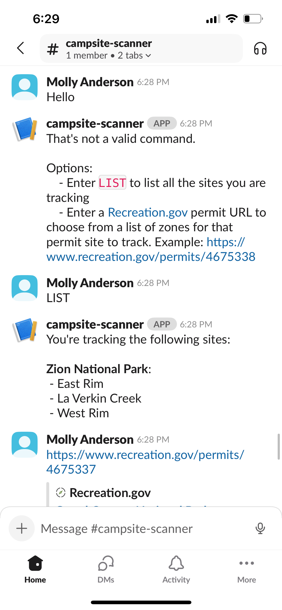
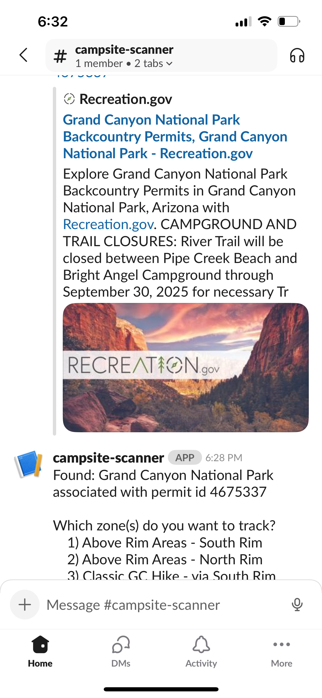
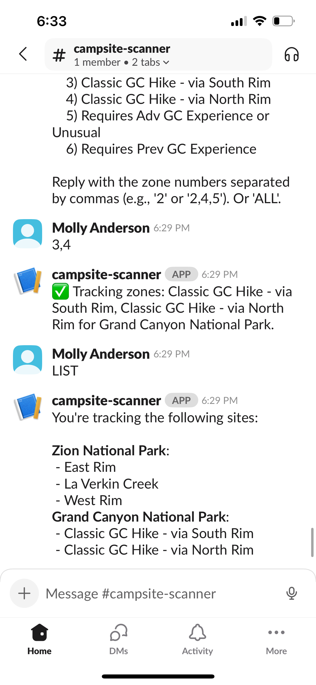

# Campsite Availability Scanner

The Campsite Availability Scanner is a lightweight .NET Web App that:     
1) You can chat with via Slack to add or view backcountry permit spots to track
2) Runs a scheduled task every 5 minutes to check for openings of the permits added to the track list and sends you a Slack notification if it finds any openings

## Getting Started
1. Download Slack on your phone
2. Join the campsite-scanner Workspace: [Join link](https://join.slack.com/t/campsite-scanner/shared_invite/zt-3cq564vz8-OZBSXUngqyBT9ZUPUig7AQ)
3. Turn on notifications for the `campsite-scanner` channel

## Adding/listing tracked permits

## Receiving notifications

## Resources
List of interesting permits:

Washington: 
- [Mount Rainier National Park Wilderness and Climbing Permits](https://www.recreation.gov/permits/4675317)
- [North Cascades National Park Backcountry Permits](https://www.recreation.gov/permits/4675322)

Utah: 
- [Grand Canyon National Park Backcountry Permits](https://www.recreation.gov/permits/4675337)
- [Zion National Park Overnight Wilderness Permits](https://www.recreation.gov/permits/4675338)
- [Bryce Canyon National Park Backcountry Permits](https://www.recreation.gov/permits/4675330)